### Hi there  PaulinaYoun 👋

---

#### 🛠️ Tech Stacks & Capability

- **Frontend:** `Svelte`
- **Backend:** `Node.js`
- **IoT & Protocols:** `MQTT` 프로토콜과 `IoT`
- **Intelligent System:** `ML (Machine Learning)`

---

<!--  -->

#### 🌿 About Me

- 🏢 AIoT 연구팀 소속, 스마트팩토리·IoT 데이터 파이프라인 개발 중
- 🌐 프론트엔드 엔지니어 (Svelte · TypeScript · Node.js)
- 🗳️ 시빅해커 — [널채움(Nullfull)](https://github.com/nullfull) 활동 중
- 🌱 발코니 텃밭을 가꾸며 언젠가 귀농을 꿈꿉니다
- 📖 컴퓨터교육학 석사 / 웹 접근성에 관심이 많아요

---

#### 🛠️ Tech Stack

**Frontend**

**Backend & Data**

**Tools & Infra**

---

#### 📂 Featured Repositories

| 레포 | 설명 | 스택 |
|---|---|---|
| [posturecoachBE](https://github.com/paulinayoun/posturecoachBE) | 자세 교정 서비스 백엔드 | Node.js |
| [kafka-consumer](https://github.com/paulinayoun/kafka-consumer) | Kafka 메시지 컨슈머 구현 | Python · Kafka |

---

#### 📊 GitHub Stats

<!-- profile/stats.svg, profile/top-langs.svg 는 GitHub Actions가 자동 생성합니다 -->
<!-- .github/workflows/readme_stats.yml 참고 -->

---

*"기술은 사람을 위해 존재합니다"*

<!--
**say3412/say3412** is a ✨ _special_ ✨ repository because its `README.md` (this file) appears on your GitHub profile.

Here are some ideas to get you started:

- 🔭 I’m currently working on ...
- 🌱 I’m currently learning ...
- 👯 I’m looking to collaborate on ...
- 🤔 I’m looking for help with ...
- 💬 Ask me about ...
- 📫 How to reach me: ...
- 😄 Pronouns: ...
- ⚡ Fun fact: ...
-->
